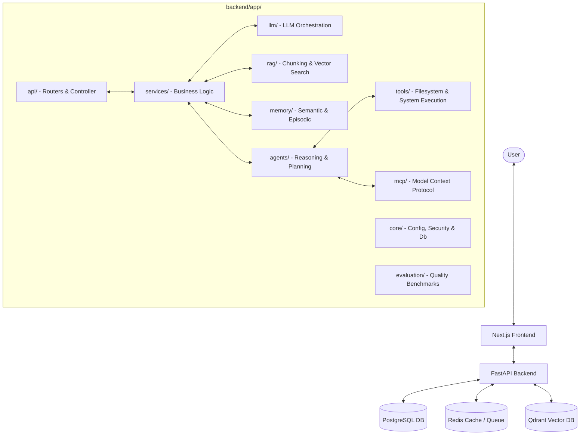

# High-Level Design (HLD) — LifeOS AI

This document provides a high-level architectural view of the LifeOS AI Agentic Personal Operating System.

---

## 1. System Architecture Diagram

---

## 2. Component Descriptions

### 2.1 Next.js Frontend
- Single Page Application providing interactive dashboards, chat windows, memory graphs, and task logs.

### 2.2 FastAPI Backend (Modular Monolith)
- **api/**: Exposes HTTP endpoints for the frontend.
- **core/**: App lifecycle, security middleware, database connections.
- **services/**: Middle tier coordinating database transactions and business logic.
- **llm/**: Standardized client wrappers for LLM providers (starting with Gemini).
- **rag/**: Text extraction, semantic text splitting, vector embedding generation, and search.
- **memory/**: Manages agent state context window compression and semantic/episodic storage.
- **agents/**: Reasoning loops (e.g., ReAct, Plan-and-Solve) and execution states.
- **tools/**: Predefined Python functions that the agent can execute (e.g., web search, file storage).
- **mcp/**: Connects to external Model Context Protocol hosts.
- **evaluation/**: Benchmarking tools for monitoring response quality and RAG hit rates.

---

## 3. Data Infrastructure

- **PostgreSQL**: Stores relational database models (Users, Task history, API tokens, Agent Sessions).
- **Redis**: Handles celery/arq background task queues, session caching, and rate limiting.
- **Qdrant**: Manages collections for document chunks, long-term memory embeddings, and context indices.
